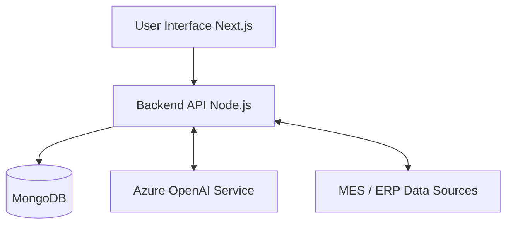

# G.A.P – Generative AI Personal Assistant for Manufacturing Industries 🏭🤖


**G.A.P (Generative AI as Personally)** is an AI-powered personal assistant platform designed specifically for **manufacturing industries**. The system integrates with industrial data sources such as MES (Manufacturing Execution Systems) and ERP (Enterprise Resource Planning) platforms to automate report generation, provide real-time analytics, and assist decision-makers with AI-driven insights.

By combining modern web technologies, industrial data integration, and **conversational AI**, G.A.P improves operational efficiency, reduces manual reporting tasks, and simplifies factory data interaction.

---

## 🌟 Key Features

- 🤖 **Automated Industrial Reporting**: Auto-generate production and maintenance reports from MES and ERP data.
- 📈 **AI-Driven Decision Making**: Gain instant insights on production efficiency, machine performance, and continuous operational costs.
- 💬 **Conversational Data Interaction**: Interact with complex factory data using natural language queries (e.g., *"Which machine had the highest downtime today?"*).
- 📊 **Real-Time Monitoring Dashboard**: Monitor machine health, production anomalies, and telemetry data via live centralized dashboards.
- 🔌 **Seamless Integration**: Connect effortlessly with your existing MES, ERP, and IoT data systems.

---

## 🏗️ System Architecture

G.A.P utilizes a modern web architecture optimized for secure, fast, and intelligent processing.



### 💻 Technology Stack

* **Frontend**: Next.js 15, React 19, Tailwind CSS, shadcn/ui, Framer Motion, Recharts
* **Backend**: Node.js, Express.js (TypeScript)
* **Database**: MongoDB (Mongoose)
* **AI Engine**: Azure OpenAI Service (Chat, Analysis, Data generation)
* **Real-time Engine**: WebSockets / Socket.IO (optional MQTT for IoT)

---

## 📂 Project Structure (Monorepo)

The repository is structured as an NPM Workspace containing three primary packages:

```text
/
├── frontend/    # Next.js web application (Dashboard & AI Chat interface)
├── backend/     # Express REST API handling AI logic and database communication
└── db/          # Shared Mongoose models and database connection logic
```

### 🧩 Core Modules

The platform acts as a centralized portal divided into three easily accessible modules:
1. **AI Assistant Module** (`/ai`) - Chat-based interface for factory operations analysis and automated reporting.
2. **ERP Module** (`/erp`) - Business and operational insights for production, inventory, cost tracking, and purchase orders.
3. **MES Module** (`/mes`) - Shop-floor operations monitoring, machine telemetry, and equipment downtime alerts.

---

## 🚀 Getting Started

### Prerequisites

* **Node.js**: v20 or newer
* **npm**: v10+
* **MongoDB**: A local instance or Atlas URI
* **Azure OpenAI**: API Key, Endpoint, and Deployment Name

### 1. Installation

Clone the repository and install all workspace dependencies from the root:
```bash
git clone https://github.com/your-username/GAP.git
cd GAP
npm install
```

### 2. Environment Variables

Create `.env` files for the respective environments based on the required configurations.

**`backend/.env`**:
```env
PORT=4000
MONGODB_URI=mongodb://localhost:27017/gap
AZURE_OPENAI_API_KEY=your_key
AZURE_OPENAI_ENDPOINT=your_endpoint
AZURE_OPENAI_DEPLOYMENT=your_deployment
AZURE_OPENAI_API_VERSION=2023-05-15
```

**`frontend/.env.local`**:
```env
NEXT_PUBLIC_API_URL=http://localhost:4000/api
# Additional NextAuth configurations can be added here
```

### 3. Running Locally

You can launch both the frontend and backend simultaneously in development mode by running:

```bash
npm run dev --workspace=backend & npm run dev --workspace=frontend
```
* **Frontend**: Available at `http://localhost:3000`
* **Backend API**: Available at `http://localhost:4000`

---

## 🐳 Docker Deployment

For standardized deployments across environments, G.A.P includes a single, combined `Dockerfile` in the root that builds and serves both the frontend and backend applications simultaneously.

### Building & Running the Image

1. **Build the Docker Image**:
```bash
docker build -t gap-application .
```

2. **Run the Container**:
Provide your environment variables at runtime to ensure the backend can connect to your database and Azure OpenAI instance.
```bash
docker run -p 3000:3000 -p 4000:4000 \
  -e NODE_ENV=production \
  -e MONGODB_URI="your_mongodb_uri" \
  -e AZURE_OPENAI_API_KEY="your_api_key" \
  -e AZURE_OPENAI_ENDPOINT="your_endpoint" \
  -e AZURE_OPENAI_DEPLOYMENT="your_deployment" \
  gap-application
```

The application UI will be accessible at `http://localhost:3000`, while the backend API routes will be exposed on `http://localhost:4000`.

---

## 🛡️ Security Features

* **Authentication**: JWT & Provider-based validation (NextAuth)
* **Authorization**: Role-based access control (Admin, Manager, Engineer, Operator)
* **Data Privacy**: Encrypted data transmission and secure API endpoints

---

## 🔮 Future Enhancements

* 📡 Predictive maintenance tracking using advanced Machine Learning models
* 🎙️ Voice-enabled AI assistant for hands-free shop-floor interactions
* 🏭 Multi-factory synchronization and monitoring
* ⚡ Automated workflow optimization actions

---

*Transform your manufacturing operations with the power of Generative AI.* 🚀
